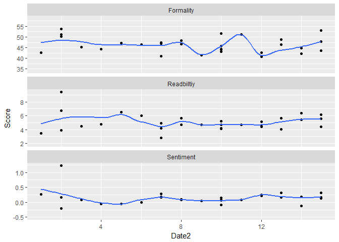

textcorpus   
============

**textcorpus** is collection of text courpus datasets. The package also
contains tools to enable easy community contributions to the package.
The underying premise is that the speech level data is stored with meta
data as a list of two tibble data frames with a common key column.

Table of Contents
============

-   [Installation](#installation)
-   [Data](#data)
-   [Demonstration](#demonstration)
    -   [Joining Corpus and Meta Data](#joining-corpus-and-meta-data)
    -   [Text Scores](#text-scores)
    -   [Plotting the Text Scores Across Time](#plotting-the-text-scores-across-time)
-   [Contact](#contact)

Installation
============

To download the development version of **textcorpus**:

Download the [zip
ball](https://github.com/trinker/textcorpus/zipball/master) or [tar
ball](https://github.com/trinker/textcorpus/tarball/master), decompress
and run `R CMD INSTALL` on it, or use the **pacman** package to install
the development version:

    if (!require("pacman")) install.packages("pacman")
    pacman::p_load_gh("trinker/textcorpus")

Data
====

<table>
<colgroup>
<col width="27%" />
<col width="15%" />
<col width="15%" />
<col width="20%" />
<col width="20%" />
</colgroup>
<thead>
<tr class="header">
<th>data</th>
<th>genre</th>
<th>subgenre</th>
<th>submitted_by</th>
<th>submitted_on</th>
</tr>
</thead>
<tbody>
<tr class="odd">
<td>
presidential_debates

</td>
<td>
debate

</td>
<td>
political

</td>
<td>
Tyler Rinker

</td>
<td><pre><code>2017-03-08</code></pre></td>
</tr>
<tr class="even">
<td>
dylan_songs

</td>
<td>
song

</td>
<td>
folk, rock

</td>
<td>
Tyler Rinker

</td>
<td><pre><code>2017-03-08</code></pre></td>
</tr>
<tr class="odd">
<td>
nixon_tapes

</td>
<td>
transcript

</td>
<td>
political

</td>
<td>
Tyler Rinker

</td>
<td><pre><code>2017-03-08</code></pre></td>
</tr>
</tbody>
</table>

Demonstration
=============

Joining Corpus and Meta Data
----------------------------

**dplyr** akes joining the corpus and meta data easy.

    pacman::p_load(tidyverse, sentimentr, formality, readability)
    pacman::p_load_current_gh('trinker/textcorpus')

    nixon_tapes

    ## $corpus
    ## # A tibble: 8,817 × 4
    ##               id       author
    ##            <chr>        <chr>
    ## 1  00 - connally        Nixon
    ## 2  00 - connally     Campbell
    ## 3  00 - connally        Nixon
    ## 4  00 - connally     Campbell
    ## 5  00 - connally        Nixon
    ## 6  00 - connally Unidentified
    ## 7  00 - connally Unidentified
    ## 8  00 - connally Unidentified
    ## 9  00 - connally Unidentified
    ## 10 00 - connally Unidentified
    ## # ... with 8,807 more rows, and 2 more variables: text <chr>, order <int>
    ## 
    ## $meta
    ## # A tibble: 31 × 4
    ##               id       date                             location minutes
    ##            <chr>     <date>                                <chr>   <dbl>
    ## 1  00 - connally 1971-03-23              White House Oval Office      30
    ## 2             01 1972-06-23              White House Oval Office       8
    ## 3             02 1972-06-23              White House Oval Office       4
    ## 4             03 1972-06-23 Old Executive Office Building Office       6
    ## 5             04 1972-09-15              White House Oval Office      34
    ## 6             05 1973-01-08 Old Executive Office Building Office       7
    ## 7             10 1973-03-17              White House Oval Office      21
    ## 8             11 1973-03-20              White House Oval Office      11
    ## 9             12 1973-03-21              White House Oval Office      83
    ## 10            13 1973-03-21 Old Executive Office Building Office      36
    ## # ... with 21 more rows

    dat <- nixon_tapes$corpus %>%
        dplyr::left_join(nixon_tapes$meta, by = 'id')

    dat

    ## # A tibble: 8,817 × 7
    ##               id       author
    ##            <chr>        <chr>
    ## 1  00 - connally        Nixon
    ## 2  00 - connally     Campbell
    ## 3  00 - connally        Nixon
    ## 4  00 - connally     Campbell
    ## 5  00 - connally        Nixon
    ## 6  00 - connally Unidentified
    ## 7  00 - connally Unidentified
    ## 8  00 - connally Unidentified
    ## 9  00 - connally Unidentified
    ## 10 00 - connally Unidentified
    ## # ... with 8,807 more rows, and 5 more variables: text <chr>, order <int>,
    ## #   date <date>, location <chr>, minutes <dbl>

Text Scores
-----------

Here we calculate formality, sentiment, and readability measures. An
additional call to **dplyr**'s `left_jon` with a `Reduce` makes it easy
to merge the various score frames into one frame.

    n_formality <- dat %>%
        filter(author == "Nixon") %>%
        with(formality(text, list(author, id, date)))

    n_sentiment <- dat %>%
        filter(author == "Nixon") %>%
        with(sentiment_by(text, list(author, id, date)))

    n_readability <- dat %>%
        filter(author == "Nixon") %>%
        with(readability(text, list(author, id, date)))

    stats_dat <- list(n_formality, n_sentiment, n_readability) %>%
        Reduce(function(x, y) left_join(x, y, by=c("author", "id", "date")), .)

Plotting the Text Scores Across Time
------------------------------------

    stats_dat %>%
        select(date, F, ave_sentiment, Average_Grade_Level) %>%
        rename(Formality = F, Sentiment = ave_sentiment, Readbiltiy = Average_Grade_Level) %>%
        gather(Measure, Score, -date) %>%
        mutate(Date = as.factor(date), Date2 = as.numeric(Date)) %>%
        ggplot(aes(x = Date2, y = Score)) +
            geom_point() +
            geom_smooth(span = 0.4, fill = NA) +
            facet_wrap(~Measure, ncol = 1, scales = 'free_y') 

    ## `geom_smooth()` using method = 'loess'

Contact
=======

You are welcome to:    
- submit suggestions and bug-reports at: <https://github.com/trinker/textcorpus/issues>    
- send a pull request on: <https://github.com/trinker/textcorpus/>    
- compose a friendly e-mail to: <tyler.rinker@gmail.com>    
